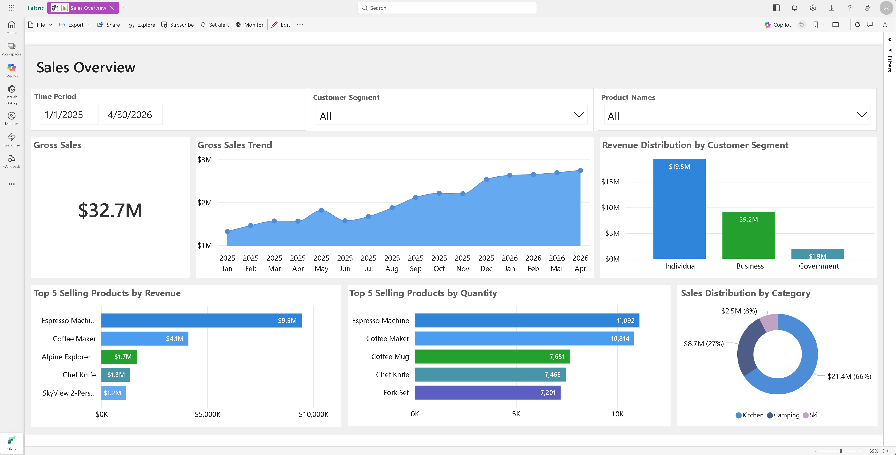
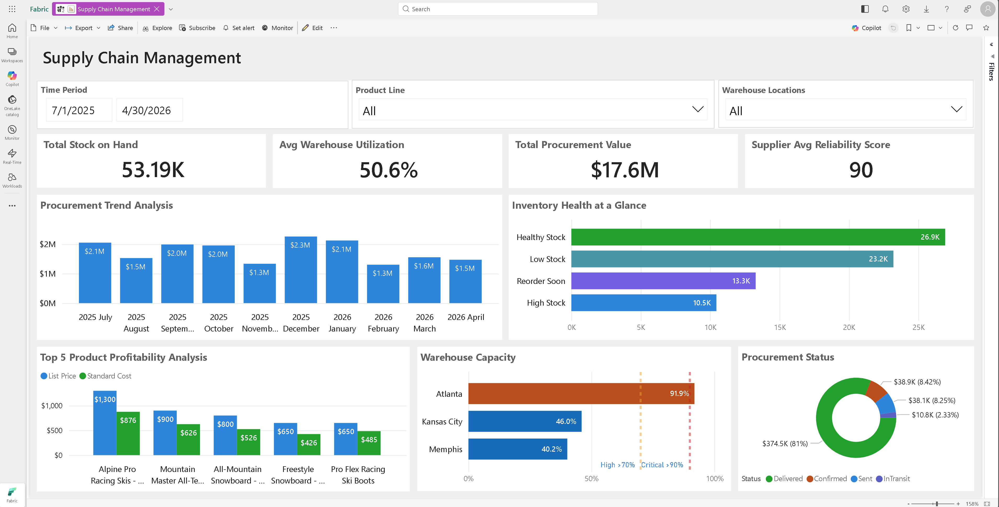

# Power BI Dashboards

This folder documents the Power BI reports shipped with the Microsoft IQ Solution Accelerator. The `.pbix` files live under [`src/fabric/dashboards/`](../../../src/fabric/dashboards/) and are intended to be published to the Microsoft Fabric workspace created by the accelerator (see [`DeploymentGuideFabric.md`](../DeploymentGuideFabric.md)).

Two reports are provided:

| Report | File | Focus |
|---|---|---|
| Sales Overview | [`Sales Overview.pbix`](../../../src/fabric/dashboards/Sales%20Overview.pbix) | Gross sales, revenue, product and customer segmentation |
| Supply Chain Management | [`Supply Chain Management.pbix`](../../../src/fabric/dashboards/Supply%20Chain%20Management.pbix) | Inventory health, warehouse utilization, procurement, supplier performance |

---

## 1. Sales Overview

**File:** [`src/fabric/dashboards/Sales Overview.pbix`](../../../src/fabric/dashboards/Sales%20Overview.pbix)

A single-page executive summary of sales performance across product lines, categories, and customer segments.

### Page: Sales Overview

Key visuals and their purpose:

| Visual | Type | Purpose |
|---|---|---|
| Gross Sales | Card | Headline gross sales KPI for the selected period |
| Gross Sales Trend | Area chart | Trend of gross sales over the selected time period |
| Top 5 Selling Products by Quantity | Clustered bar chart | Best-selling SKUs measured by units sold |
| Top 5 Selling Products by Revenue | Clustered bar chart | Best-selling SKUs measured by revenue |
| Sales Distribution by Category | Donut chart | Mix of gross sales across product categories / product lines |
| Revenue Distribution by Customer Segment | Column chart | Revenue mix across customer types |
| Time Period / Customer Segment / Product Names slicers | Slicer | Filter by time period, customer segment, and product |

### Typical questions answered

- What are our total gross sales and how are they trending?
- Which products drive the most units and the most revenue?
- How is revenue distributed across product lines and customer segments?
- How do sales trend over the selected time period?

---

## 2. Supply Chain Management

**File:** [`src/fabric/dashboards/Supply Chain Management.pbix`](../../../src/fabric/dashboards/Supply%20Chain%20Management.pbix)

A single-page operational view of inventory, warehouse capacity, procurement, and supplier performance.

### Page: Supply Chain Management

Key visuals and their purpose:

| Visual | Type | Purpose |
|---|---|---|
| Total Stock on Hand | Card | Current inventory quantity across warehouses |
| Avg Warehouse Utilization | Card | Average capacity utilization across warehouses |
| Total Procurement Value | Card | Aggregate value of purchase orders |
| Supplier Avg Reliability Score | Card | Portfolio-level supplier reliability |
| Procurement Trend Analysis | Clustered column chart | Purchase order value over time (monthly) |
| Inventory Health at a Glance | Clustered bar chart | Stock health status breakdown (Healthy Stock, Low Stock, Reorder Soon, High Stock) |
| Top 5 Product Profitability Analysis | Clustered column chart | Margin view using list price vs. standard cost for top products |
| Warehouse Capacity | Clustered bar chart with reference lines | Per-warehouse capacity utilization with High (>70%) and Critical (>90%) thresholds |
| Procurement Status | Donut chart | Breakdown of purchase orders by status (Delivered, Confirmed, Sent, InTransit) |
| Time Period / Product Line / Warehouse Locations slicers | Slicer | Filter by time period, product line, and warehouse |

### Typical questions answered

- How much stock do we currently hold and how healthy is it?
- How well are our warehouses utilized, and which ones are near capacity?
- How is procurement spend trending over time, and what is the current status of purchase orders?
- How reliable are our suppliers overall?
- Which products contribute the most profit given list price vs. standard cost?
